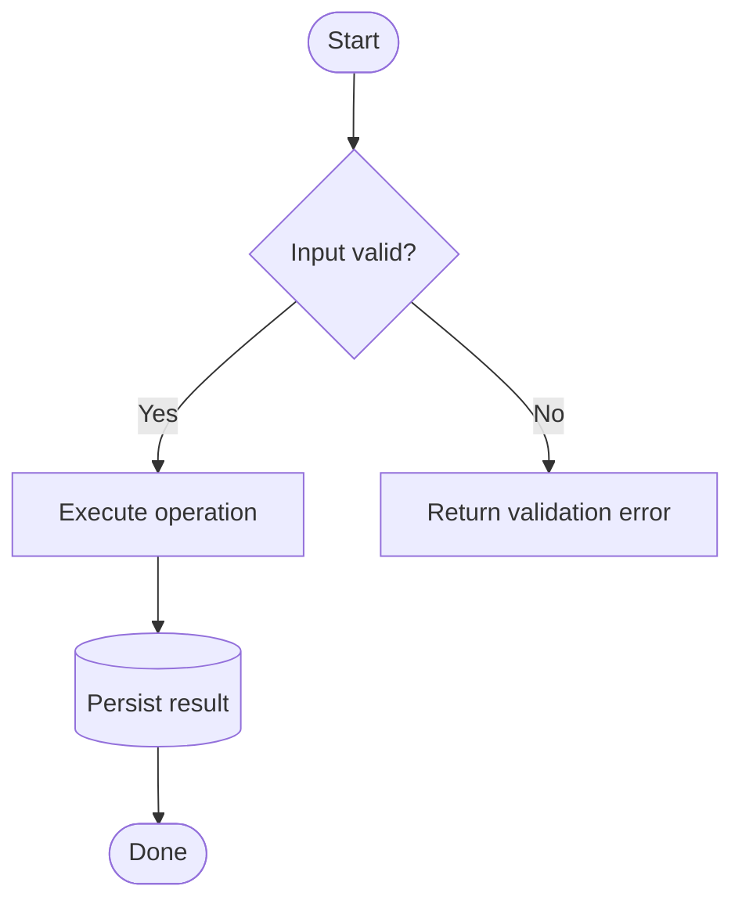
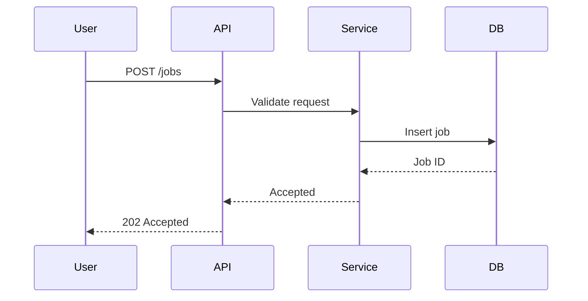
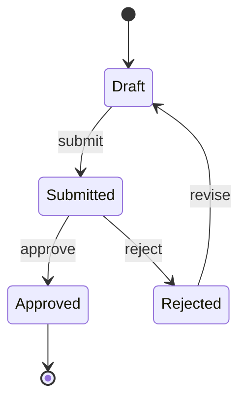
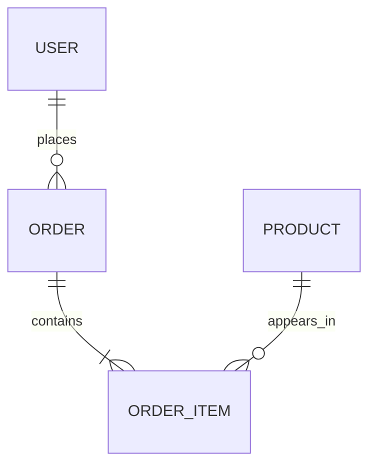

# Diagram Starters

Use these as clean starting points and adapt incrementally.

## Process Flow

```mermaid
flowchart TB
    Start([Start]) --> Validate{Input valid?}
    Validate -->|Yes| Execute[Execute operation]
    Validate -->|No| Reject[Return validation error]
    Execute --> Persist[(Persist result)]
    Persist --> End([Done])
```

## Service Interaction

```mermaid
sequenceDiagram
    participant U as User
    participant A as API
    participant S as Service
    participant D as DB

    U->>A: POST /jobs
    A->>S: Validate request
    S->>D: Insert job
    D-->>S: Job ID
    S-->>A: Accepted
    A-->>U: 202 Accepted
```

## State Lifecycle

```mermaid
stateDiagram-v2
    [*] --> Draft
    Draft --> Submitted: submit
    Submitted --> Approved: approve
    Submitted --> Rejected: reject
    Rejected --> Draft: revise
    Approved --> [*]
```

## Domain Model

```mermaid
erDiagram
    USER ||--o{ ORDER : places
    ORDER ||--|{ ORDER_ITEM : contains
    PRODUCT ||--o{ ORDER_ITEM : appears_in
```