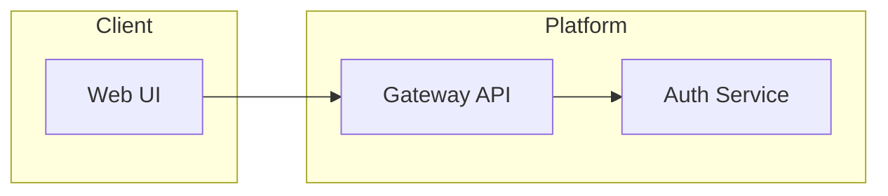
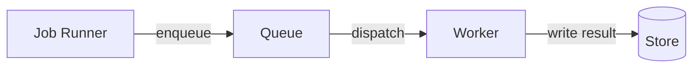
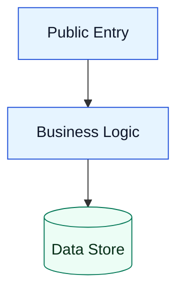

# Advanced Flowchart Patterns

Apply these patterns for expressive but reliable flowcharts.

## 1. Direction and Layout

- Declare direction explicitly at the top: `flowchart LR`, `flowchart TB`, `flowchart RL`, or `flowchart BT`.
- Use `LR` for service architecture and pipeline narratives.
- Use `TB` for procedures and runbooks.

## 2. Subgraphs for Bounded Contexts

Use subgraphs to cluster ownership or runtime boundaries.

## 3. Semantic Edge Labels

Keep edge labels short and action-oriented.

## 4. Styling with Class Definitions

Define classes once, then assign by node ID.

## 5. Safe Labeling Rules

- Quote labels with commas, colons, parentheses, or uncommon punctuation.
- Avoid lowercase `end` as literal node text.
- Keep label text concise to reduce layout instability.

## 6. Complexity Control

- Split giant flows into multiple linked diagrams.
- Keep each diagram focused on one operational question.
- Prefer repeated simple patterns over one dense supergraph.